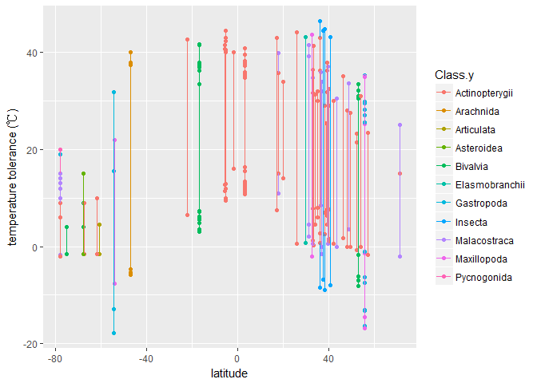

Thermal tolerance limits of ectotherms by different group
================

``` r
data_sunday_update <-fread("E:/origin_data/species_data/all_thermal_data_combined_more_lons_JS.csv")
```

``` r
data.subset.tem <- data_sunday_update %>% 
                   select(Phylum.y,Class.y,Order.y,Family.y,habitat,Genus,Species,tmax,tmin,lat,lon) %>%
                   filter(!is.na(tmax) & !is.na(tmin) & !is.na(lat)) %>% 
                   mutate(SN = paste0(Genus," ",Species))

                  

data.subset.tem.tmin<- data.subset.tem  %>% 
                       select(Phylum.y,Class.y,Order.y,Family.y,habitat,Genus,Species,tmin,lat,lon,SN) 
                       
colnames(data.subset.tem.tmin)[8] <-"tem"

data.subset.tem.tmax<- data.subset.tem  %>% 
                       select(Phylum.y,Class.y,Order.y,Family.y,habitat,Genus,Species,tmax,lat,lon,SN) 
                       
colnames(data.subset.tem.tmax)[8] <-"tem"

                    
data.subset<-rbind(data.subset.tem.tmax,data.subset.tem.tmin)
```


``` r
data.subset.marine<- data.subset %>% 
                          filter(habitat != "terrestrial")

ggplot(data.subset.marine, aes(x=lat, y=tem,colour= Class.y)) + geom_point() + geom_line(aes(group = lat))+xlab("latitude")+ylab("temperature tolerance (℃)")
```



\`\`\`
